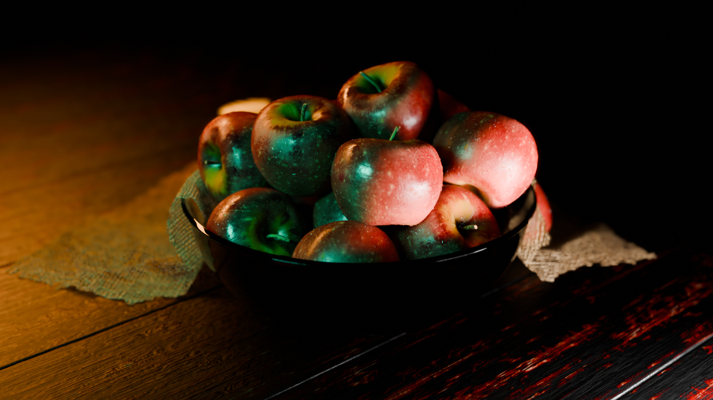

# 🍎 Basket of Apples

A realistic 3D basket filled with apples, created as my first 3D modeling project.  

---

 

## 🖼️ Renders
  
  

---

 

## 📂 Files Included
- `basket_of_apples.blend` – Blender source file  
- `textures/` – Texture file
- `output/` - Front and back views of the basket

---

 

## 🛠️ Tools & Skills
- **Modeling**: Blender  
- **Texturing**: Blender Texture Paint  
- **Rendering**: Blender Eevee
- **Techniques**:  
  - Shading  
  - UV unwrapping  
  - Realistic texturing  

---

 

## 🚀 Notes
This model can be used for **game assets, animation, or visualizations**.  
