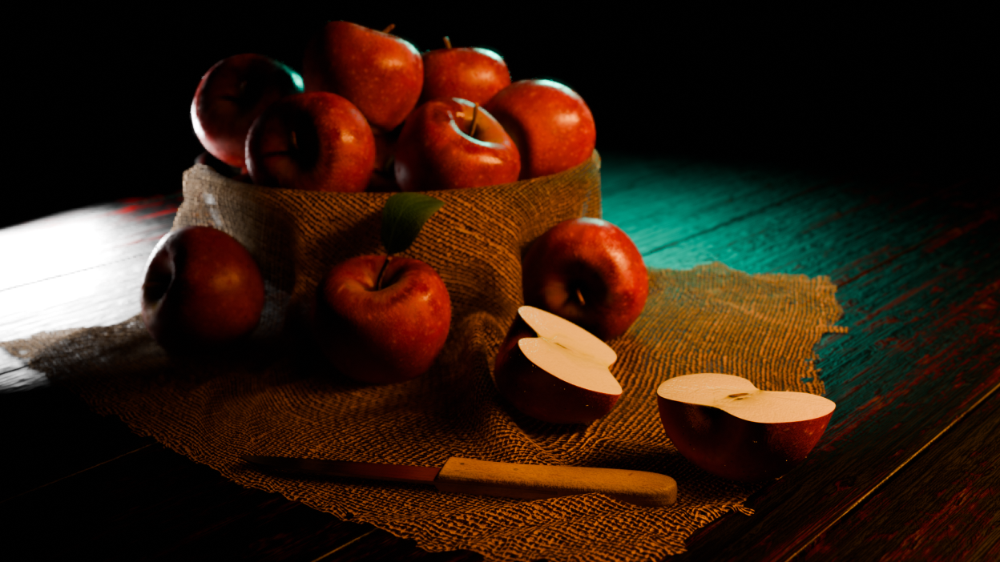

# 🎨 3D Models Collection – Minoli Perera  

A curated collection of my **3D modeling projects**, created using Blender, Maya, and other tools.  
These models showcase **characters, environments, and props** — highlighting my creativity, technical skills, and eye for detail.  

---
<br>

## ✨ Featured Models  

### 🍎 Basket of Apples  

*A realistic 3D basket filled with apples, optimized for rendering and interactive applications.*  
- Formats: `.blend`  
- Textures: Metal, Normal, Roughness  
👉 [View full details](Props/basket_of_apples/README.md)  

---

<br>

## 📂 Repository Structure  

```bash
3d-models/
│
├── Props/
│   └── BasketOfApples/
│       ├── README.md
│       ├── basket_of_apples.blend
│       ├── textures/
│       └── output/
│
└── README.md

```

---
<br>

# 🚀 About Me

I’m Minoli Perera, an IT undergraduate passionate about full-stack development, UI/UX design, and 3D art.
This repo showcases my journey in 3D modeling for games, animation, and design projects.

🔗 Check out my [GitHub Portfolio](https://github.com/MinoliPerera021126)

💼 Connect with me on [LinkedIn](http://www.linkedin.com/in/hk-minoli-perera)
